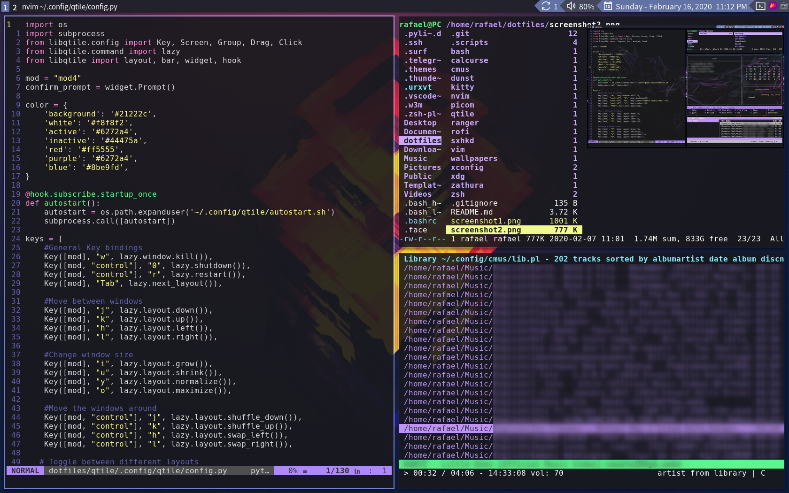

# Raph's Dotfiles  

This config was structured so that [GNU Stow](https://www.gnu.org/software/stow/) could be used to quickly set everything up.  

## Screenshots  

  
  

## Details  

- **WM**: [Qtile](http://www.qtile.org/)  
- **Terminal**: Kitty  
- **Application launcher**: Rofi  
- **Wallpaper setter**: Feh  
- **Wallpapers**: [here](./wallpapers/Pictures/Wallpapers/)  
- **Text Editors**: NeoVim & VSCode  
- **Keybindings daemon**: sxhkd  

## Keybindings  

|          Action         | Shortcut                       |
|:-----------------------:|--------------------------------|
| **General Keybindings**                                  |
| Kill window             | super + w                      |
| Kill Qtile              | super + control + 0            |
| Lock screen             | super + control + 9            |
| Restart Qtile           | super + control + r            |
| Switch layout           | super + tab                    |
| Volume control          | super + arrow keys             |
| **Moving around**                                        |
| Move between windows    | super + [h, j, k, l]           |
| Change window size      | super + [y, u, i, o]           |
| Move windows around     | super + control + [h, j, k, l] |
| **Programs**                                             |
| Terminal                | super + return                 |
| File Manager            | super + F1                     |
| Firefox                 | super + F2                     |
| Visual Studio Code      | super + F3                     |
| System Monitor          | super + F4                     |
| Mail client             | super + F5                     |
| Note-taking app         | super + F6                     |
| Calendar app            | super + c                      |
| Music player            | super + m                      |
| Program Launcher        | super + r                      |
| Terminal file manager   | super + v                      |
| **Volume and CMUS external control**			   |
| Volume up		  | super + up                     |
| Volume down		  | super + down                   |
| Next song		  | super + right                  |
| Previous song		  | super + left                   |
| Pause 		  | super + p                      |
| **Other layouts**                                        |
| Toggle floating window  | super + control + space        |
| Fullscreen              | super + f                      |

## Installation  
Note: The script only works with arch-based distros.   

After cloning the repository run:  
```sh
$ ./dotfiles/.scripts/install.sh # Functional but there are still side effects if run more than once
```   
To install the packages needed and that I use, run:
```sh
$ sudo ./dotfiles/.scripts/pacin.sh # Installs dependencies and programs I use frequently
$ ./dotfiles/.scripts/aurpacs.sh # Installs aur packages I use
```  

### Manual installation  
Remove colliding dotfiles between the repo and your home folder and run:  
```sh
$ cd ~/dotfiles && rm *.md *.png && stow --adopt *
```  
If you don't remove your dotfiles that collide with the repo's then your dotfiles will be used instead, if it doesn't exist then mine will be used instead. For more information read Stow's man page.  

Note:  
You will probably want to edit Qtile's config file and install the following if you intend to use my Zsh and Vim configurations:  
- [Oh my Zsh!](https://ohmyz.sh/)  
- [Zsh-syntax-highlighting](https://github.com/zsh-users/zsh-syntax-highlighting/blob/master/INSTALL.md)  
Make sure to clone both *Oh my Zsh!* and *Zsh-syntax-highlighting* to the ~/zsh-plugins directory or source them yourself  
- [Vim-plug](https://github.com/junegunn/vim-plug)  
