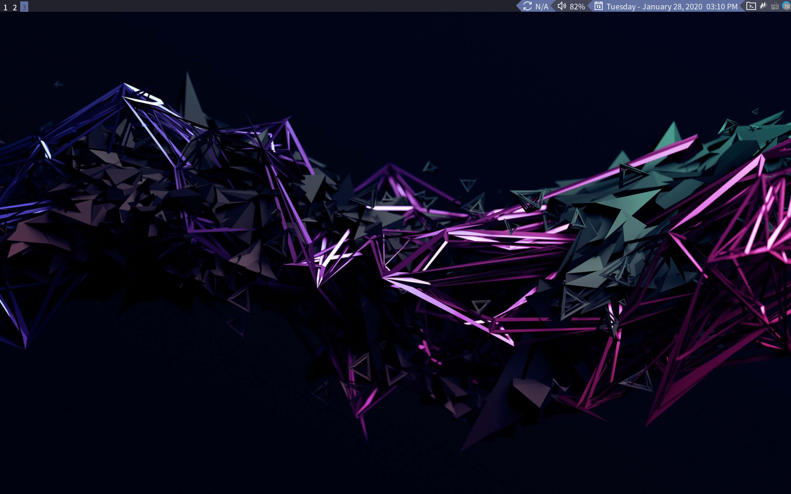

# Raph's Dotfiles  

## Screenshots  



## Details  

- **WM**: [Qtile](http://www.qtile.org/) 
- **Terminal**: kitty  
- **Application launcher**: Rofi  
- **Wallpaper setter**: Feh  
- **Wallpapers**: [here](./wallpapers/Pictures/Wallpapers/)  
- **Text Editors**: NeoVim & VSCode  
- **Keybindings daemon**: sxhkd  

## Keybindings  

| Action                               | Shortcut                       |
|--------------------------------------|--------------------------------|
| **General Keybindings**              |                                |
| Close window                         | super + w                      |
| Kill window                          | super control + x              |
| Logout                               | super + control + 0            |
| Lock screen*                         | super + control + 9            |
| Restart window manager               | super + control + r            |
| **Moving around**                    |                                |
| Move between windows                 | super + {h, j, k, l}           |
| Change window size                   | super + {y, u, i, o}           |
| Move windows around                  | super + control + {h, j, k, l} |
| **Programs**                         |                                |
| Terminal                             | super + return                 |
| GUI file Manager                     | super + F1                     |
| Firefox                              | super + F2                     |
| Visual Studio Code                   | super + F3                     |
| System Monitor                       | super + F4                     |
| Mail client                          | super + F5                     |
| Note-taking app(vim plugin)          | super + F6                     |
| Calendar app                         | super + c                      |
| Music player                         | super + m                      |
| Application Launcher                 | super + r                      |
| Terminal file manager                | super + v                      |
| **Volume and CMUS external control** |                                |
| Volume up                            | super + up                     |
| Volume down                          | super + down                   |
| Next song                            | super + period                 |
| Previous song                        | super + comma                  |
| Forward song                         | super + control + period       |
| Backward song                        | super + control + comma        |
| Pause                                | super + p                      |
| **Layouts**                          |                                |
| Toggle monocle layout                | super + tab                    |
| Toggle floating window               | super + control + space        |
| Fullscreen                           | super + f                      |

## Installation
To set all the dotfiles make sure you have stow installed and then run:  
```sh
curl -sL https://raw.githubusercontent.com/RaphGL/Dotfiles/master/.scripts/configdf > /tmp/configdf.sh && chmod +x /tmp/configdf.sh && bash /tmp/configdf.sh; rm -f configdf.sh
```   

After setting everything up you will probably want to install the programs necessary to run dotfiles.  
Note: I've created package lists for Arch and Fedora. You can find them at `Dotfiles/.lists`.
The minimal install installs only the bare minimum to get you up and running, you will have to install most programs yourself.  

Just run your package manager like this:

```sh
sudo package_manager $(cat ~/Dotfiles/.lists/distro-packages.list)
```

After installing them you will probably want to setup keybindings for them, to do so just type the following aliases on the terminal:  
* `kb` for keyboard shortcuts
* `qtilec` for the qtile config
* `nvimc` for the neovim config

## License  
[WTFPL](http://www.wtfpl.net/) © RaphGL
