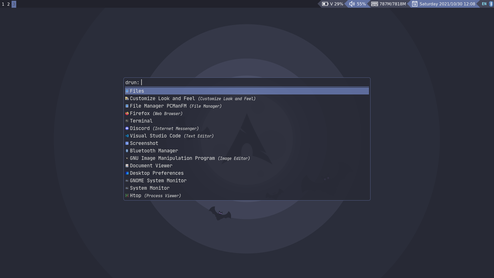

# Raph's Dotfiles  
This config was structured so that GNU Stow could be used to quickly set everything up.

## Details  

- **WM**: Qtile  
- **Terminal**: urxvt  
- **Application launcher**: Rofi  
- **Wallpaper setter**: Nitrogen  
- **Text Editor**: Vim & VSCode  

## Screenshots  

  
  
  

## Keybindings  